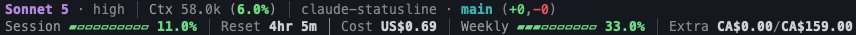

# claude-statusline

A hand-rolled status line for [Claude Code](https://claude.com/claude-code),
replacing [ccstatusline](https://github.com/sirmalloc/ccstatusline) with a
single dependency-free Node script that adds threshold-based dynamic
coloring ccstatusline doesn't support.



## Setup

Requires Node.js on `PATH` — no other dependencies.

1. Clone this repo somewhere on the machine.
2. Add a `statusLine` block to `~/.claude/settings.json`, pointing `command`
   at the absolute path of `statusline.js` in your clone (merge this in if
   the file already has other keys):

```json
{
  "statusLine": {
    "type": "command",
    "command": "node /path/to/claude-statusline/statusline.js",
    "padding": 0,
    "refreshInterval": 10
  }
}
```

3. Restart Claude Code (or start a new session) to pick up the change.

## What it shows

Two lines:

1. Account badge | model + thinking effort | context window usage | git
   branch + changes (+ins/-del) | Node version (if `package.json` present)
2. Session usage bar+% | time until session reset | session cost | weekly
   usage bar+% | extra usage used/limit

Any segment can be hidden or relabeled per account — see
[Multiple accounts](#multiple-accounts) below.

## Multiple accounts

The script is `CLAUDE_CONFIG_DIR`-aware, so one clone works for every
account you switch between (e.g. a personal Pro subscription plus a work/
enterprise account under a separate config dir) without needing separate
clones. A shell wrapper picks the config dir based on the working directory:

```sh
# ~/.zshrc
claude() {
  case "$PWD" in
    "$HOME/code/fieldguide"|"$HOME/code/fieldguide"/*)
      CLAUDE_CONFIG_DIR=~/.claude-work command claude "$@"
      ;;
    *)
      command claude "$@"
      ;;
  esac
}
```

The first time you run `claude` under a new `CLAUDE_CONFIG_DIR`, log in with
`/login` — that account's session, settings, and status line config all live
under that directory, isolated from the default `~/.claude`.

Each profile needs its own `statusLine` block in its own `settings.json`
(`~/.claude/settings.json` for the default account,
`$CLAUDE_CONFIG_DIR/settings.json` for any other), pointing at the same
script — see [Setup](#setup).

The status line shows a colored account badge (`PERSONAL` in blue for the
default config dir, an auto-derived label in orange for any other — e.g.
`~/.claude-work` becomes `WORK`) so it's obvious at a glance which account
is active. Usage-API lookups (Keychain service name, on-disk cache) are also
namespaced per config dir, so accounts never leak into each other's cached
stats.

## Customization

Set these in the `env` block of the relevant profile's `settings.json` (the
same file that holds its `statusLine` block):

- `CLAUDE_STATUSLINE_HIDE` — comma-separated segment keys to omit. Valid
  keys: `badge, model, context, git, node, session, reset, cost, weekly,
  extra`. Useful for e.g. an API-pricing account that has no five-hour/
  weekly subscription limits to show.
- `CLAUDE_STATUSLINE_LABELS` — comma-separated `key=value` pairs to rename a
  segment's label without changing its behavior, e.g. `badge=FIELDGUIDE`.
  Same keys as above (minus `model`/`git`/`node`, which have no label text).
- `CLAUDE_STATUSLINE_COST_CURRENCY` — `CAD` (default) or `USD`. Claude
  Code's `cost.total_cost_usd` field is misleadingly named — in practice
  it's been observed reporting CAD regardless of account, so this declares
  what the raw number actually is; the script converts and shows the other
  currency alongside it.

Example, for a US-enterprise-flavored account that only cares about spend:

```json
{
  "env": {
    "CLAUDE_STATUSLINE_HIDE": "session,reset,weekly",
    "CLAUDE_STATUSLINE_LABELS": "badge=FIELDGUIDE,cost=Session,extra=Total",
    "CLAUDE_STATUSLINE_COST_CURRENCY": "CAD"
  },
  "statusLine": {
    "type": "command",
    "command": "node /path/to/claude-statusline/statusline.js",
    "padding": 0,
    "refreshInterval": 10
  }
}
```

## How it works

Most fields come straight from the JSON Claude Code pipes to the status
line command on stdin (model, cost, `context_window`, `transcript_path`,
`workspace.current_dir`). Two things aren't in that JSON and have to be
recovered separately:

- **Thinking effort** — every `type: "assistant"` entry in the session's
  transcript JSONL carries a top-level `effort` field (e.g. `"high"`).
  The script tails the transcript file and reads the most recent one.
- **Session/weekly/extra usage** — Claude Code doesn't expose this via any
  documented API. It's fetched from Anthropic's undocumented
  `GET https://api.anthropic.com/api/oauth/usage` endpoint, authenticated
  with the same OAuth access token Claude Code itself uses:
  - On macOS: `security find-generic-password -s "Claude Code-credentials" -w`
    for the default config dir, or `-s "Claude Code-credentials-<hash>"`
    (sha256 of the resolved `CLAUDE_CONFIG_DIR` path, first 8 hex chars) for
    any other — Claude Code namespaces the Keychain entry the same way, so
    this has to match it exactly per account.
  - Fallback / other platforms: `$CLAUDE_CONFIG_DIR/.credentials.json`
    (or `~/.claude/.credentials.json` by default).

  `extra_usage.monthly_limit` / `used_credits` are minor units (typically
  cents) scaled by `extra_usage.decimal_places`, not raw dollars.

  Results are cached to `~/.cache/claude-statusline/<account>/usage.json`
  (`<account>` is `default` or the same config-dir hash used for the
  Keychain lookup) for 180s so a 10s status line refresh doesn't hammer the
  endpoint, and so multiple accounts never read each other's cached data.

## Tuning

Everything adjustable lives in constants at the top of `statusline.js`:

- `THRESHOLDS` — the green/amber/red cutoffs (default `<50%` / `50-80%` /
  `>=80%`) shared by session %, weekly %, and extra-usage utilization.
- `CONTEXT_TOKEN_THRESHOLDS` — absolute token cutoffs (default 80k/120k) for
  coloring the context window token count.
- `CURRENCY_SYMBOL` — currency code to symbol mapping for cost/extra-usage
  amounts.
